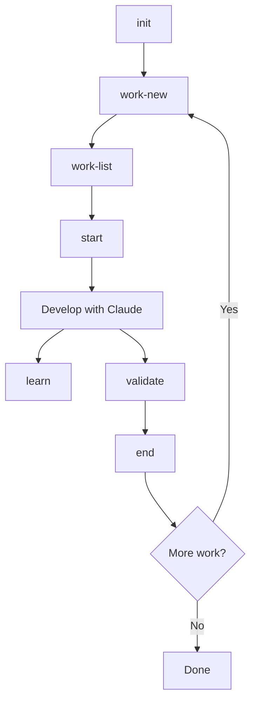

# SDD (Session-Driven Development)

[](https://pypi.org/project/session-driven-development/)
[](https://github.com/ankushdixit/sdd/actions?query=workflow%3ATests)
[](https://www.python.org/downloads/)
[](LICENSE)
[](https://github.com/ankushdixit/sdd)
[](https://github.com/ankushdixit/sdd/stargazers)
[](https://github.com/ankushdixit/sdd/issues)

**Session-Driven Development for Claude Code** - Maintain perfect context across multiple AI coding sessions.

> **Note:** This is designed for solo developers using Claude Code. It provides comprehensive session management, quality gates, and knowledge accumulation for AI-augmented software development.

## Overview

**SDD** implements **Session-Driven Development**, a comprehensive methodology that enables AI coding assistants to work on software projects across multiple sessions with perfect context continuity, enforced quality standards, and accumulated institutional knowledge.

### The Problem

Traditional AI coding sessions suffer from:
- **Context loss** between sessions - AI forgets what was done previously
- **Quality entropy** over time - Standards slip without enforcement
- **Knowledge fragmentation** across interactions - Learnings get lost
- **Lack of process rigor** - No systematic workflow for complex projects

### The Solution

Session-Driven Development provides:
- **Perfect context continuity** through automated briefings that load full project state
- **Quality enforcement** via automated validation gates (tests, linting, security scans)
- **Knowledge accumulation** through learnings system with AI-powered categorization
- **Dependency-driven workflow** (logical ordering based on dependencies, not arbitrary sequences)
- **Living documentation** that stays current automatically with git integration

## Features

### Core Commands

**Session Management:**
- `/init` - Initialize project with .session/ structure
- `/start` - Begin work session with comprehensive briefing
- `/end` - Complete session with quality gates and summary
- `/validate` - Pre-flight check before session completion
- `/status` - Quick session overview

**Work Item Management:**
- `/work-new` - Create new work item with dependencies
- `/work-list` - List work items with filters
- `/work-show` - Show work item details
- `/work-update` - Update work item fields
- `/work-next` - Get next recommended work item
- `/work-graph` - Visualize dependencies with critical path

**Learning Management:**
- `/learn` - Capture insight during development
- `/learn-show` - Browse learnings with filters
- `/learn-search` - Full-text search across learnings
- `/learn-curate` - Run curation process (categorize, deduplicate, merge)

### Key Capabilities

✅ **Stateful Development** - Perfect context handoffs between sessions
✅ **Quality Gates** - Tests, linting, formatting enforced before completion
✅ **Dependency Management** - Work items ordered by logical dependencies
✅ **Learning System** - Auto-categorized knowledge base with smart deduplication
✅ **Visualization** - Dependency graphs with critical path analysis
✅ **Git Integration** - Standardized commits with session summaries

### Dependency Graph Visualization

Visualize project structure and identify bottlenecks with dependency graphs:

```bash
# Via slash command
/work-graph
/work-graph --critical-path
/work-graph --bottlenecks
/work-graph --milestone "Phase 3"

# Via CLI
sdd work-graph
sdd work-graph --format svg --output graph.svg
sdd work-graph --stats
```

**Features:**
- **Critical Path Highlighting** - Red nodes/edges show longest dependency chain
- **Bottleneck Detection** - Identify items blocking multiple other items
- **Multiple Formats** - ASCII (terminal), DOT (Graphviz), SVG (visual)
- **Flexible Filtering** - By status, milestone, type, or focus on specific items
- **Timeline Projection** - Estimate completion based on dependency levels

### Learning System

Automated knowledge capture and curation with AI-powered categorization:

```bash
# Via slash commands
/learn                    # Capture insight conversationally
/learn-show               # Browse all learnings
/learn-show --category gotchas --tag fastapi
/learn-search "CORS"      # Full-text search
/learn-curate             # Run curation (categorize, deduplicate, merge)

# Via CLI
sdd learn-show
sdd learn-search "keyword"
sdd learn-curate --dry-run
```

**Features:**
- **6 Learning Categories** - Auto-categorized (architecture, gotchas, best practices, technical debt, performance, security)
- **3 Extraction Sources** - Session summaries, git commits (`LEARNING:` annotations), inline code comments (`# LEARNING:`)
- **Similarity Detection** - Jaccard + containment algorithms detect duplicates
- **Smart Deduplication** - Automatically merges similar learnings
- **Advanced Filtering** - By category, tag, session, date range
- **Statistics Dashboard** - Total learnings, by category, top tags, growth over time
- **Timeline View** - Learning history by session
- **Auto-Curation** - Runs every N sessions (configurable)

## Installation

### Option 1: Claude Code Plugin + PyPI (Recommended)

For the best experience with both slash commands and CLI:

**Step 1:** Install the SDD plugin from Claude Code marketplace (`ankushdixit/claude-plugins`)

**Step 2:** Install the Python package:
```bash
pip install session-driven-development
```

**Step 3:** Verify installation:
```bash
sdd status
```

Now you have:
- ✅ Slash commands available in Claude Code (`/sdd:init`, `/sdd:start`, `/sdd:end`, etc.)
- ✅ CLI commands available globally (`sdd status`, `sdd work-list`, etc.)

### Option 2: From Source (For Contributors)

For development or customization:

```bash
# Clone repository
git clone https://github.com/ankushdixit/sdd.git
cd sdd

# Install as editable package
pip install -e .

# Optional: Install with dev tools
pip install -e ".[dev]"

# Verify installation
sdd status
```

This installs the package in editable mode, allowing you to modify the source code.

### Verify Installation

```bash
# Check sdd command is available
which sdd

# Test the CLI
sdd status

# Optional: Run test suite
pytest tests/ -v
```

### Prerequisites

- **Claude Code**: Required for slash command integration
- **Python 3.9+**: Core scripts require Python
- **Git**: Required for version control integration
- **Optional Tools** (for quality gates):
  - `pytest`, `ruff` (Python linting/testing)
  - `bandit`, `safety` (Security scanning)
  - `eslint`, `prettier` (JavaScript/TypeScript)
  - `graphviz` (Dependency graph visualization)

Quality gates gracefully skip when tools aren't available.

## Quick Start

### 1. Initialize Your Project

Start by initializing the Session-Driven Development structure in your project:

```
/init
```

This creates:
- `.session/` directory with tracking files
- `work_items.json` for task management
- `learnings.json` for knowledge capture
- `status_update.json` for session state
- `tracking/` subdirectory for stack, tree, and other artifacts
- `config.json` with project configuration

### 2. Create Your First Work Item

Create a work item (task) to work on:

```
/work-new
```

Follow the conversational prompts to specify:
- Type (feature, bug, refactor, security, integration_test, deployment)
- Title and description
- Acceptance criteria
- Dependencies (if any)
- Priority level

### 3. Start a Development Session

When ready to work, start a session:

```
/start
```

Or specify a work item ID:

```
/start WI-001
```

This generates a comprehensive briefing including:
- Work item details and acceptance criteria
- Project documentation (vision, architecture, PRD)
- Current technology stack
- Project structure (tree)
- Git status and branch information
- Related learnings from past sessions
- Dependency context

### 4. Work on Your Task

Develop your feature/fix with Claude Code's assistance. During the session:

- **Capture learnings:**
  ```
  /learn
  ```

- **Check session status:**
  ```
  /status
  ```

- **Validate readiness:**
  ```
  /validate
  ```

### 5. Complete the Session

When done, end the session:

```
/end
```

This automatically:
- Runs quality gates (tests, linting, security scans)
- Updates stack and tree tracking
- Extracts learnings from your work
- Commits changes with standardized message
- Pushes to remote
- Updates work item status
- Generates session summary

## Typical Workflow



## Work Item Management

### Viewing Work Items

```
/work-list                    # All work items
/work-list --status not_started  # Filter by status
/work-list --milestone "Phase 1"  # Filter by milestone
/work-show WI-001             # Show specific item
```

### Managing Dependencies

```
/work-graph                   # Visualize all dependencies
/work-graph --critical-path   # Show critical path
/work-graph --bottlenecks     # Identify blockers
/work-next                    # Get next available item
```

### Updating Work Items

```
/work-update WI-001 --status in_progress
/work-update WI-001 --priority high
```

## Spec-First Workflow

**The spec file is the single source of truth for work item content.**

SDD implements a **spec-first architecture** (Phase 5.7) where work item specifications are the authoritative source for implementation details, acceptance criteria, and testing strategies.

### Architecture Overview

```
.session/
├── specs/
│   ├── feature_xyz.md      ← Single source of truth (content)
│   └── deployment_abc.md
└── tracking/
    └── work_items.json      ← Tracking only (metadata, status, dependencies)
```

### Key Concepts

**Spec Files (`.session/specs/{work_item_id}.md`)**
- **Content**: Implementation details, acceptance criteria, testing strategy
- **Format**: Structured markdown with standardized sections
- **Validation**: Checked for completeness before session starts
- **Briefings**: Passed in full to Claude (no compression)

**Work Items JSON (`work_items.json`)**
- **Tracking**: ID, type, status, priority, dependencies, sessions
- **Metadata Only**: No duplicate content (previously stored rationale, acceptance criteria)

### Workflow

1. **Create Work Item:**
   ```bash
   /work-new
   # Creates .session/specs/{work_item_id}.md from template
   # Creates tracking entry in work_items.json
   ```

2. **Fill Out Specification:**
   - Open `.session/specs/{work_item_id}.md`
   - Complete all required sections for the work item type
   - Follow template guidance and inline comments
   - See `docs/guides/writing-specs.md` for best practices

3. **Start Session:**
   ```bash
   /start {work_item_id}
   # Loads full spec file into briefing
   # Validates spec completeness
   # Shows warnings if spec is incomplete
   ```

4. **Work on Implementation:**
   - Claude receives complete spec content in briefing
   - All acceptance criteria and implementation details available
   - No context loss from compression or truncation

5. **Complete Session:**
   ```bash
   /end
   # Validates spec completeness as quality gate
   # Generates commit message from spec rationale
   ```

### Spec Templates

SDD provides comprehensive templates for 6 work item types:

| Type | Template | Required Sections |
|------|----------|-------------------|
| **Feature** | `templates/feature_spec.md` | Overview, Rationale, Acceptance Criteria, Implementation Details, Testing Strategy |
| **Bug** | `templates/bug_spec.md` | Description, Steps to Reproduce, Root Cause Analysis, Fix Approach |
| **Refactor** | `templates/refactor_spec.md` | Overview, Current State, Proposed Refactor, Scope |
| **Security** | `templates/security_spec.md` | Security Issue, Threat Model, Attack Vector, Mitigation Strategy, Compliance |
| **Integration Test** | `templates/integration_test_spec.md` | Scope, Test Scenarios, Performance Benchmarks, Environment Requirements |
| **Deployment** | `templates/deployment_spec.md` | Deployment Scope, Procedure, Rollback, Smoke Tests |

### Validation

Specs are automatically validated for:
- ✅ Required sections present and non-empty
- ✅ Minimum 3 acceptance criteria items
- ✅ Required subsections (e.g., deployment procedure steps)
- ✅ Proper structure and formatting

**Validation occurs:**
- During `/start` - Warning displayed in briefing if spec incomplete
- During `/end` - Quality gate fails if spec incomplete
- Manually via scripts (for development)

### Benefits

- **Zero Context Loss**: Claude receives complete specifications, not truncated JSON fields
- **Better Quality**: Comprehensive specs lead to better implementations
- **Single Source of Truth**: No confusion about where content lives
- **Validation**: Catch incomplete specs before starting work
- **Templates**: Standardized structure for consistency

For more information:
- **Writing Specs**: `docs/guides/writing-specs.md`
- **Template Structure**: `docs/reference/spec-template-structure.md`
- **Session-Driven Development**: `docs/architecture/session-driven-development.md`

## Configuration

Configure SDD via `.session/config.json` (created during `/init`):

```json
{
  "quality_gates": {
    "tests": {"enabled": true, "required": true, "coverage_threshold": 80},
    "linting": {"enabled": true, "required": false, "auto_fix": true},
    "formatting": {"enabled": true, "required": false, "auto_fix": true},
    "security": {"enabled": true, "required": true, "fail_on": "high"},
    "documentation": {"enabled": true, "required": false}
  },
  "learning_curation": {
    "auto_curate": true,
    "frequency": 5
  },
  "git": {
    "auto_push": true,
    "auto_merge": false
  }
}
```

### Quality Gate Configuration

- `enabled`: Run this gate
- `required`: Block `/end` if fails
- `auto_fix`: Automatically fix issues (linting/formatting)
- `coverage_threshold`: Minimum test coverage (%)
- `fail_on`: Security threshold (critical, high, medium, low)

### Learning Curation

- `auto_curate`: Automatically run curation
- `frequency`: Run every N sessions

### Git Configuration

- `auto_push`: Automatically push after `/end`
- `auto_merge`: Automatically merge branch if work item complete

## Documentation

- [Documentation Index](docs/README.md) - Complete documentation navigation
- [Architecture Overview](docs/ARCHITECTURE.md) - System architecture and components
- [Session-Driven Development Framework](docs/architecture/session-driven-development.md) - Complete methodology specification
- [AI-Augmented Solo Framework](docs/architecture/ai-augmented-solo-framework.md) - Philosophical context and broader methodology
- [Implementation Insights](docs/architecture/implementation-insights.md) - Lessons learned and proven patterns
- [Learning System Guide](docs/reference/learning-system.md) - Knowledge capture and curation details
- [Configuration Guide](docs/guides/configuration.md) - Project configuration options
- [Troubleshooting](docs/guides/troubleshooting.md) - Common issues and solutions
- [Roadmap](docs/project/ROADMAP.md) - Phased development plan

## Project Structure

```
sdd/
├── .claude/                  # Claude Code command definitions
│   └── commands/             # 15 slash commands (auto-discovered by Claude Code)
├── src/sdd/                  # Python package (standard src/ layout)
│   ├── cli.py                # CLI entry point
│   ├── core/                 # Core functionality (file ops, logging, config)
│   ├── session/              # Session management (briefing, complete, status, validate)
│   ├── work_items/           # Work item management (CRUD, specs, validation)
│   ├── learning/             # Learning system (capture & curation)
│   ├── quality/              # Quality gates and validation
│   ├── visualization/        # Dependency graphs
│   ├── git/                  # Git integration
│   ├── testing/              # Testing utilities
│   ├── deployment/           # Deployment executor
│   ├── project/              # Project initialization and management
│   └── templates/            # Work item specification templates
├── docs/                     # Comprehensive documentation
│   ├── commands/             # Command reference documentation
│   ├── architecture/         # System architecture and design
│   ├── guides/               # User guides and how-tos
│   ├── reference/            # Reference documentation
│   ├── project/              # Project planning (roadmap, bugs, enhancements)
│   └── development/          # Development notes
├── tests/                    # Test suites (1408 tests total)
│   ├── unit/                 # Unit tests
│   ├── integration/          # Integration tests
│   └── e2e/                  # End-to-end tests
├── README.md                 # This file
├── CHANGELOG.md              # Version history
├── CONTRIBUTING.md           # Contribution guidelines
├── LICENSE                   # MIT License
├── Makefile                  # Developer convenience targets
└── pyproject.toml            # Package configuration (PEP 517/518)
```

## Architecture Notes

### Standard Python Package Structure (v0.6.0+)

SDD follows **standard Python packaging best practices** using src/ layout:

**Current Implementation (v0.6.0):**
- ✅ **Standard src/ layout**: Full PEP 517/518 compliance
- ✅ **No sys.path manipulation**: Clean imports throughout codebase
- ✅ **Domain-organized modules**: Code organized by functionality
- ✅ **Unified CLI**: All commands use `sdd` command
- ✅ **Pip installable**: `pip install -e .` for development
- ✅ **Plugin compatible**: Works with Claude Code marketplace plugins
- ✅ **PyPI-ready**: Can be published to PyPI

**For Contributors:**
Import from the sdd package using standard Python imports:
```python
from sdd.work_items.manager import WorkItemManager
from sdd.quality.gates import QualityGates
from sdd.session.briefing import generate_briefing
```

**Package Organization:**
- `sdd.core` - Core functionality (file ops, logging, config)
- `sdd.session` - Session management
- `sdd.work_items` - Work item management and specs
- `sdd.learning` - Learning capture and curation
- `sdd.quality` - Quality gates and validation
- `sdd.visualization` - Dependency graphs
- `sdd.git` - Git integration
- `sdd.testing` - Testing utilities
- `sdd.deployment` - Deployment execution
- `sdd.project` - Project initialization

See [ROADMAP.md Phase 5.9](docs/project/ROADMAP.md#phase-59-package-structure-refactoring-v060---python-best-practices) for migration details.

## Development Status

**Current Status:** Production-ready for personal use (Phases 0-5.6 complete)

### Completed Phases

| Phase | Version | Description | Status |
|-------|---------|-------------|--------|
| Phase 0 | v0.0 | Foundation & Documentation | ✅ Complete |
| Phase 1 | v0.1 | Core Plugin Foundation | ✅ Complete |
| Phase 2 | v0.2 | Work Item System | ✅ Complete |
| Phase 3 | v0.3 | Dependency Visualization | ✅ Complete |
| Phase 4 | v0.4 | Learning Management | ✅ Complete |
| Phase 5 | v0.5 | Quality Gates | ✅ Complete |
| Phase 5.5 | v0.5.5 | Integration Testing | ✅ Complete |
| Phase 5.6 | v0.5.6 | Deployment Support | ✅ Complete |
| Phase 5.7 | v0.5.7 | Spec-First Architecture | ✅ Complete |
| Phase 5.8 | v0.5.8 | Marketplace Plugin Support | ✅ Complete |

### Release History

See [CHANGELOG.md](./CHANGELOG.md) for detailed release notes and version history.

**Current Version:** v0.5.8 (Phase 5.8 Complete - Marketplace Plugin Support)

### Test Coverage

**Total: 392/392 tests passing (100%)** (Note: Will run tests after changes)

- Phase 1: 6/6 tests ✅
- Phase 2: 9/9 tests ✅
- Phase 3: 11/11 tests ✅
- Phase 4: 12/12 tests ✅
- Phase 5: 12/12 tests ✅
- Phase 5.5: 178/178 tests ✅
- Phase 5.6: 65/65 tests ✅
- Phase 5.7: 49/49 tests ✅
- Phase 0: Manual validation ✅

### Upcoming Phases

- **Phase 6** (v0.6): Spec-Kit Integration - Import work items from specifications
- **Phase 7** (v0.7+): Advanced Features - Templates, metrics, AI enhancements

See [ROADMAP.md](ROADMAP.md) for detailed phase breakdown and timelines.

## Technology Stack

- **Language:** Python 3.9+
- **Integration:** Claude Code slash commands
- **Visualization:** Graphviz (for dependency graphs)
- **Testing:** pytest (for quality gates)
- **Linting:** ruff (for code quality)

## Core Algorithms

SDD includes battle-tested algorithms:

- **Dependency Resolution** - DFS-based critical path analysis
- **Learning Categorization** - Keyword-based auto-categorization (6 categories)
- **Similarity Detection** - Jaccard + containment similarity for deduplication
- **Quality Gates** - Multi-stage validation pipeline

## Design Principles

1. **AI-Native Design** - Built for Claude's environment, not as external tool
2. **Atomic Operations** - Safe file writes, consistent state updates
3. **Fail-Safe** - Quality gates prevent broken states from propagating
4. **Zero Context Loss** - Comprehensive briefings ensure perfect handoffs
5. **Deterministic** - Repeatable, predictable workflows

## FAQ

### Q: How do I install this?

**Via Marketplace (easiest):**
1. Install SDD plugin from Claude Code marketplace
2. Run: `pip install -e ~/.claude/plugins/marketplaces/claude-plugins/sdd`

**Direct installation:**
```bash
git clone https://github.com/ankushdixit/sdd.git
cd sdd
pip install -e .
```

### Q: Do I need to install all the optional tools?

No. Quality gates gracefully skip when tools aren't available. Install only what you need for your project.

### Q: Can I use this with other AI assistants?

This is specifically designed for Claude Code's slash command system. It won't work with other AI tools without modification.

### Q: How much disk space does the .session directory use?

Typically 1-5 MB for most projects. It stores JSON files, text files, and small logs.

### Q: Can I customize work item types?

Currently, 6 built-in types are supported (feature, bug, refactor, security, integration_test, deployment). Custom types are planned for Phase 7.

### Q: Does this work with GitHub/GitLab?

Yes. It uses standard git commands and integrates with any git remote.

### Q: What happens if I forget to run /end?

Your work is still saved in git. You can manually update work items and tracking files, but you'll miss automated quality gates and learning extraction.

### Q: Can I use this on multiple projects?

Yes! After installing once (via marketplace or direct), use SDD in any project. Each project gets its own `.session/` directory with independent tracking.

## Troubleshooting

### /init fails with "Directory already exists"

The `.session/` directory already exists. Either delete it (`rm -rf .session/`) or use your existing setup.

### Quality gates fail even though tests pass

Check:
1. Exit codes from test commands
2. Coverage threshold in config
3. Required vs optional gate settings

### Git integration not working

Ensure:
1. Git repository is initialized (`git init`)
2. Remote is configured (`git remote -v`)
3. Working directory is clean or changes are staged

### Learning curation not triggering

Check `.session/config.json`:
- `auto_curate` should be `true`
- `frequency` should be a positive integer (default: 5)

### Commands fail with "Permission denied"

Make the CLI executable:
```bash
chmod +x sdd/sdd_cli.py
# Or if using symlink installation:
chmod +x ~/sdd/sdd_cli.py
```

### Commands fail with "ModuleNotFoundError"

Ensure you're running commands from your project root, not from within the `sdd/` directory. The CLI uses relative paths that work from the project root.

## Contributing

Contributions are welcome! This project follows standard open-source contribution guidelines:

1. Fork the repository
2. Create a feature branch (`git checkout -b feature/your-feature`)
3. Make your changes with tests
4. Run the test suite (`pytest tests/`)
5. Commit your changes
6. Push to your fork
7. Open a Pull Request

### Development Setup

```bash
# Clone the repo
git clone https://github.com/ankushdixit/sdd.git
cd sdd

# Install development dependencies
pip install pytest pytest-cov

# Run tests
pytest tests/

# Run specific phase tests
pytest tests/phase_1/
pytest tests/phase_5/test_phase_5_complete.py
```

## Credits

Built with insights from building complex software projects with Claude Code assistance.

Inspired by professional software development practices adapted for AI-augmented solo development.

---

**Ready for use!** Phases 0-5.8 complete with 392/392 tests passing.
