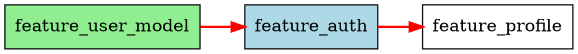

# Implementation Insights
## Lessons Learned from Building Session-Dev (Python CLI Prototype)

This document consolidates valuable implementation insights from the first attempt at building Session-Driven Development tooling. These insights will inform the Claude Code plugin implementation.

---

## 1. Session Structure

### Session Lifecycle

**Initialization (session-start)**
1. Validate environment (git clean, dependencies met)
2. Select next work item (dependency-aware)
3. Generate briefing file with:
   - Work item objectives
   - Previous session notes
   - Relevant learnings
   - Implementation checklist
   - Dependency status
4. Present briefing to AI
5. Begin implementation

**Completion (session-end)**
1. Run quality gates:
   - Test execution (with coverage requirements)
   - Linting (with auto-fix)
   - Code formatting
   - Type checking (optional)
2. Update tracking files:
   - work_items.json status
   - status_update.json summary
   - learnings.json (from session notes)
   - stack.txt (from code changes)
3. Generate session summary
4. Create git commit (standardized format)

### Briefing Generation Pattern

**Effective briefing structure:**
```markdown
# Session N Briefing

## Work Item: [title]
ID: [id]
Type: [feature|bug|refactor|etc]
Priority: [high|medium|low]

## Objective
[Clear, concise objective statement]

## Rationale
[Why this work matters]

## Context
### Previous Sessions
[Relevant notes from prior work]

### Dependencies
- [dependency 1] ✅ completed
- [dependency 2] ✅ completed

### Related Learnings
[Relevant gotchas, patterns from learnings.json]

## Implementation Checklist
- [ ] Task 1
- [ ] Task 2
- [ ] Tests
- [ ] Documentation

## Acceptance Criteria
[Specific completion criteria]

## Validation Requirements
- Tests must pass
- Coverage: 80%+
- Linting: pass
- Documentation: updated
```

**Key insight:** The more specific and contextual the briefing, the better Claude's implementation quality.

---

## 2. Work Item System

### Data Model (Proven Schema)

```json
{
  "id": "feature_authentication",
  "type": "feature",
  "title": "Implement OAuth2 Authentication",
  "status": "not_started",
  "priority": "high",

  "sessions": [],
  "milestone": "mvp_v1",

  "dependencies": ["feature_user_model", "feature_database_setup"],
  "dependents": ["feature_profile_page"],

  "specification_path": ".session/specs/authentication.md",
  "implementation_paths": ["src/auth/", "src/middleware/auth.py"],
  "test_paths": ["tests/auth/"],

  "validation_criteria": {
    "tests_pass": true,
    "coverage_min": 80,
    "linting_pass": true,
    "documentation_required": true,
    "security_scan_required": true
  },

  "metadata": {
    "created_at": "2025-10-01T10:00:00",
    "completed_at": null,
    "time_estimate": "3-4 sessions",
    "actual_time": null
  },

  "session_notes": {
    "1": "Implemented OAuth2 flow, discovered refresh token expiry issue",
    "2": "Fixed token refresh, added comprehensive tests"
  },

  "rationale": "Users need secure authentication with OAuth2 providers",
  "acceptance_criteria": [
    "Users can sign in with Google/GitHub",
    "Tokens refresh automatically",
    "Session persists across browser restarts"
  ]
}
```

### Dependency Resolution Algorithm

**Insight:** Dependency-driven work item selection is critical for maintaining logical flow.

```python
def get_next_work_item(work_items):
    """
    Select next available work item where all dependencies are satisfied.
    Returns item with highest priority among available items.
    """
    available = []

    for item in work_items:
        if item.status != "not_started":
            continue

        # Check if all dependencies are completed
        deps_satisfied = all(
            work_items[dep_id].status == "completed"
            for dep_id in item.dependencies
        )

        if deps_satisfied:
            available.append(item)

    # Sort by priority: critical > high > medium > low
    available.sort(key=lambda x: priority_weight(x.priority), reverse=True)

    return available[0] if available else None
```

### Dependency Graph Visualization

**Implementation:** Three output formats proved useful:

1. **ASCII Art** (terminal-friendly):
```
┌─────────────────────┐
│ feature_user_model  │  [COMPLETED]
└──────────┬──────────┘
           │
           ▼
┌─────────────────────┐
│ feature_auth        │  [IN_PROGRESS] ⚡ CRITICAL PATH
└──────────┬──────────┘
           │
           ▼
┌─────────────────────┐
│ feature_profile     │  [NOT_STARTED]
└─────────────────────┘
```

2. **DOT Format** (Graphviz):


3. **SVG** (visual documentation)

**Critical Path Analysis:**
```python
def calculate_critical_path(work_items):
    """
    Find longest chain of dependencies using depth-first traversal.
    Items on critical path are highest priority for schedule.
    """
    def get_depth(item_id, memo={}):
        if item_id in memo:
            return memo[item_id]

        item = work_items[item_id]
        if not item.dependencies:
            depth = 0
        else:
            depth = 1 + max(get_depth(dep) for dep in item.dependencies)

        memo[item_id] = depth
        return depth

    # Calculate depths for all items
    depths = {item_id: get_depth(item_id) for item_id in work_items}
    max_depth = max(depths.values())

    # Trace back critical path
    critical_path = set()
    for item_id, depth in depths.items():
        if depth == max_depth:
            critical_path.add(item_id)
            # Add all dependencies on path to max depth
            for dep in work_items[item_id].dependencies:
                if depths[dep] == depth - 1:
                    critical_path.add(dep)

    return critical_path
```

---

## 3. Learning Management System

### Learning Data Model

```json
{
  "id": "learn_001",
  "category": "gotcha",
  "content": "FastAPI async routes require async database connections",
  "context": "Using sync SQLAlchemy in async routes causes blocking",
  "session": 5,
  "work_item": "feature_api_endpoints",
  "created_at": "2025-10-05T14:30:00",
  "tags": ["fastapi", "async", "database"],
  "related_files": ["src/api/routes.py", "src/db/connection.py"]
}
```

### Category Types

Proven categories:
- **architecture_patterns**: System design decisions, patterns, component structure
- **gotchas**: Pitfalls, traps, bugs, challenges, surprises
- **best_practices**: Conventions, standards, quality guidelines
- **technical_debt**: Refactoring needs, workarounds, legacy issues
- **performance**: Optimization insights, speed improvements, memory management
- **security**: Vulnerability patterns, secure coding practices
- **tooling**: Build system, CI/CD, development environment insights

### Auto-Categorization Algorithm

**Keyword-based scoring** (surprisingly effective without ML):

```python
CATEGORY_KEYWORDS = {
    "architecture_patterns": [
        "architecture", "design", "pattern", "component", "module",
        "structure", "layer", "separation", "coupling", "cohesion"
    ],
    "gotchas": [
        "gotcha", "trap", "pitfall", "bug", "issue", "problem",
        "challenge", "surprise", "unexpected", "careful", "watch out"
    ],
    "best_practices": [
        "best practice", "convention", "standard", "guideline",
        "should", "always", "never", "prefer", "recommended"
    ],
    "technical_debt": [
        "refactor", "cleanup", "legacy", "workaround", "hack",
        "debt", "temporary", "improve", "revisit", "TODO"
    ],
    "performance": [
        "performance", "optimization", "speed", "fast", "slow",
        "memory", "cache", "efficiency", "latency", "throughput"
    ],
}

def auto_categorize(learning_content):
    """
    Score learning content against category keywords.
    Returns category with highest score.
    """
    content_lower = learning_content.lower()
    scores = {}

    for category, keywords in CATEGORY_KEYWORDS.items():
        score = sum(
            content_lower.count(keyword)
            for keyword in keywords
        )
        scores[category] = score

    max_category = max(scores.items(), key=lambda x: x[1])
    return max_category[0] if max_category[1] > 0 else "best_practices"
```

### Similarity Detection

**Enhanced algorithm** using Jaccard + containment similarity:

```python
STOPWORDS = {
    "the", "a", "an", "and", "or", "but", "in", "on", "at", "to",
    "for", "of", "with", "by", "from", "as", "is", "was", "are",
    "been", "be", "have", "has", "had", "do", "does", "did"
}

def are_similar(learning_a, learning_b,
                jaccard_threshold=0.6,
                containment_threshold=0.8):
    """
    Detect if two learnings are duplicates/similar.

    Uses:
    - Jaccard similarity: |A ∩ B| / |A ∪ B|
    - Containment similarity: |A ∩ B| / min(|A|, |B|)
    """
    content_a = learning_a["content"].lower()
    content_b = learning_b["content"].lower()

    # Remove stopwords for better signal
    words_a = set(w for w in content_a.split() if w not in STOPWORDS)
    words_b = set(w for w in content_b.split() if w not in STOPWORDS)

    if not words_a or not words_b:
        return False

    overlap = len(words_a & words_b)
    total = len(words_a | words_b)
    min_size = min(len(words_a), len(words_b))

    jaccard = overlap / total if total > 0 else 0
    containment = overlap / min_size if min_size > 0 else 0

    return jaccard > jaccard_threshold or containment > containment_threshold
```

**Key insight:** Containment similarity catches cases where one learning is a more detailed version of another.

### Learning Extraction from Sessions

```python
def extract_learnings_from_session(session_summary):
    """
    Automatically extract learnings from session summaries.
    Looks for common patterns in session notes.
    """
    learnings = []

    # Check "Challenges Encountered" section
    if "challenges_encountered" in session_summary:
        for challenge in session_summary["challenges_encountered"]:
            learnings.append({
                "category": "gotcha",
                "content": challenge,
                "session": session_summary["session_number"]
            })

    # Check "Learnings" field if present
    if "learnings" in session_summary:
        learnings.extend(session_summary["learnings"])

    # Look for ADR-style decisions
    if "decisions_made" in session_summary:
        for decision in session_summary["decisions_made"]:
            learnings.append({
                "category": "architecture_patterns",
                "content": decision,
                "session": session_summary["session_number"]
            })

    return learnings
```

### Curation Workflow

**Automated curation process:**
1. Extract learnings from recent sessions
2. Auto-categorize new learnings
3. Detect and merge similar/duplicate learnings
4. Archive old, unreferenced learnings (50+ sessions old)
5. Generate curation report

**Configuration:**
```json
{
  "auto_curate_enabled": true,
  "curation_frequency_days": 7,
  "max_session_age_for_archive": 50,
  "similarity_threshold": 0.6
}
```

---

## 4. Quality Gates System

### Validation Pipeline

**Post-session validation (in order):**

1. **Test Execution**
   ```bash
   pytest --cov=src --cov-report=term --cov-report=html
   ```
   - Run all tests
   - Check coverage meets minimum (default 80%)
   - Generate coverage report

2. **Linting**
   ```bash
   ruff check --fix .
   ```
   - Auto-fix issues when possible
   - Fail if unfixable errors remain
   - Check for common code smells

3. **Formatting**
   ```bash
   ruff format --check .
   ```
   - Verify code is properly formatted
   - Auto-format if needed

4. **Type Checking** (optional)
   ```bash
   mypy src/
   ```
   - Validate type hints
   - Catch type-related bugs

5. **Documentation Validation**
   - Check if CHANGELOG updated
   - Verify docstrings present
   - Ensure README current

**Key insight:** Auto-fix when possible (linting, formatting), but fail hard on tests.

### Validation Result Format

```json
{
  "session": 5,
  "timestamp": "2025-10-05T16:00:00",
  "passed": true,
  "gates": {
    "tests": {
      "passed": true,
      "details": {
        "total": 47,
        "passed": 47,
        "failed": 0,
        "skipped": 0,
        "coverage": 87
      }
    },
    "linting": {
      "passed": true,
      "issues_found": 3,
      "issues_fixed": 3
    },
    "formatting": {
      "passed": true,
      "files_formatted": 2
    },
    "documentation": {
      "passed": true,
      "checks": ["changelog", "readme", "docstrings"]
    }
  }
}
```

---

## 5. Session Summary Generation

### Summary Structure

```json
{
  "session_number": 5,
  "date": "2025-10-05",
  "work_items_completed": ["feature_auth"],
  "work_items_in_progress": [],

  "achievements": [
    "Implemented OAuth2 authentication flow",
    "Added token refresh mechanism",
    "Created 15 unit tests with 92% coverage"
  ],

  "challenges_encountered": [
    "Refresh token expiry not handled correctly",
    "Race condition in token storage"
  ],

  "learnings": [
    {
      "category": "gotcha",
      "content": "OAuth2 refresh tokens must be stored atomically"
    }
  ],

  "decisions_made": [
    {
      "decision": "Use Redis for token storage",
      "rationale": "Need atomic operations and TTL support",
      "alternatives_considered": ["PostgreSQL", "In-memory"]
    }
  ],

  "files_changed": 8,
  "tests_added": 15,
  "lines_added": 342,
  "lines_removed": 87,

  "next_session_priorities": [
    "Add session management",
    "Implement logout endpoint"
  ],

  "validation_results": {
    "tests_passed": true,
    "coverage": 92,
    "linting_passed": true
  }
}
```

**Key insight:** Rich summaries enable better briefings for future sessions.

---

## 6. Git Integration Patterns

### Commit Message Format

```
Session N: [Work item title]

- [Achievement 1]
- [Achievement 2]
- [Achievement 3]

Work items completed:
- [work_item_id]: [title]

Validation: ✅ Tests (92% coverage) | ✅ Linting | ✅ Formatting

🤖 Generated with [Claude Code](https://claude.com/claude-code)

Co-Authored-By: Claude <noreply@anthropic.com>
```

### Git Workflow Pattern

1. Check if working directory is clean
2. Stage all changes (or specific paths)
3. Generate commit message from session summary
4. Create commit
5. Optionally push to remote

**Key insight:** Always validate git state before starting session to avoid confusion.

---

## 7. Project Initialization

### Directory Structure Created

```
.session/
├── tracking/
│   ├── work_items.json          # Work item definitions
│   ├── status_update.json       # Latest summary
│   ├── learnings.json           # Knowledge base
│   ├── stack.txt                # Tech stack
│   └── project_tree.txt         # Project structure
├── briefings/
│   └── session_NNN_briefing.md  # Generated briefings
├── history/
│   └── session_NNN_summary.md   # Completed sessions
└── specs/
    └── [work_item_specs]        # Detailed specifications
```

### Initial Configuration Template

```json
{
  "project": {
    "name": "project-name",
    "type": "web_application",
    "description": "Project description"
  },

  "paths": {
    "tracking": ".session/tracking",
    "briefings": ".session/briefings",
    "history": ".session/history",
    "specs": ".session/specs"
  },

  "validation_rules": {
    "post_session": {
      "tests_pass": true,
      "linting_pass": true,
      "formatting_pass": true,
      "test_coverage_min": 80
    }
  },

  "runtime_standards": {
    "linting": {
      "enabled": true,
      "tool": "ruff",
      "auto_fix": true
    },
    "formatting": {
      "enabled": true,
      "tool": "ruff"
    },
    "testing": {
      "enabled": true,
      "tool": "pytest",
      "coverage_tool": "pytest-cov"
    }
  }
}
```

---

## 8. Gotchas and Lessons Learned

### Python Package Approach Was Wrong

**Issue:** Built as standalone Python CLI tool that runs separately from Claude Code.

**Problem:**
- Claude can bypass scripts and import Python directly
- No determinism - scripts in `.session/scripts/` were meant to be the contract
- Dogfooding created confusion (mixing project state with package source)
- Wrong distribution model (PyPI package vs. personal tool)

**Solution for Plugin:**
- Build as Claude Code plugin (native extension)
- Commands are first-class slash commands in Claude
- No separate process, no terminal interaction
- Scripts are plugin hooks, not standalone tools

### Empty Script Directory Bug

**Issue:** `ProjectInitializer` created `.session/scripts/` but never populated it.

**Cause:**
- `_create_directories()` creates directory structure
- No method to generate script files
- `templates/` directory was empty
- CLAUDE.md referenced direct Python commands, not scripts

**Learning:** When dogfooding, incomplete initialization is obvious. In fresh projects, missing files are silent failures.

### Session Summary Extraction

**Issue:** Session summaries were too basic (just work items completed + metrics).

**Missing:**
- Learnings weren't automatically extracted
- Decisions not captured
- Challenges not recorded
- Context for future sessions lost

**Solution for Plugin:**
- Prompt Claude to explicitly capture learnings during session
- Include "Decisions Made" section in summaries
- Extract challenges from error messages / trial-and-error
- Rich summaries enable better briefings

### Dependency Validation Timing

**Issue:** Originally validated dependencies at session start only.

**Problem:** Dependencies could break during session (tests fail, API changes).

**Solution:** Validate dependencies at both session start AND session end.

### Coverage Threshold Flexibility

**Issue:** Single global coverage threshold (80%) too rigid.

**Problem:**
- Some modules (utilities) should have 90%+
- Some modules (UI) realistically 60-70%
- New code vs. legacy code different standards

**Solution:** Allow per-work-item coverage requirements in validation_criteria.

---

## 9. Porting to Claude Code Plugin

### Architecture Changes

**Terminal CLI → Claude Code Plugin**

| Terminal CLI Approach | Claude Code Plugin |
|------------|-------------------|
| Shell commands for session start | `/session-start` slash command |
| Shell commands for session complete | `/session-end` slash command |
| Shell commands for work items | `/work-item` slash command |
| CLI framework | Plugin command markdown files |
| Standalone scripts | Plugin hooks in `.claude-plugin/hooks/` |
| External execution | Loaded as Claude extension |

### What to Keep (High Value)

✅ **All algorithms and logic:**
- Dependency resolution algorithm
- Critical path analysis
- Learning categorization (keyword-based)
- Similarity detection (Jaccard + containment)
- Briefing generation patterns
- Session summary structure
- Quality gate pipeline

✅ **Data schemas:**
- WorkItem model
- Learning model
- SessionSummary model
- ValidationCriteria model
- Configuration structure

✅ **Framework concepts:**
- Session-driven workflow
- Dependency-driven work item selection
- Quality gate enforcement
- Knowledge accumulation
- Living documentation

### What to Discard (Wrong Layer)

❌ **Package infrastructure:**
- `pyproject.toml`, `setup.py`
- Click CLI framework
- PyPI distribution
- Package versioning
- Unit tests for package code

❌ **Dogfooding artifacts:**
- Current `.session/` state (mixed with implementation)
- Git history (documents wrong approach)
- README focused on package installation

### Plugin-Specific Additions

**New capabilities enabled by plugin:**
1. **Direct CLAUDE.md integration** - Plugin instructions part of context
2. **Native slash commands** - First-class UI in Claude Code
3. **Hooks for automation** - Event-driven workflow
4. **Subagents** - Specialized agents for complex tasks
5. **No terminal interaction** - Pure Claude UI
6. **Cross-project portability** - Install once, use everywhere

---

## 10. Recommended Implementation Order

### Phase 1: Core Plugin (Week 1)
1. Plugin manifest and structure
2. `/session-start` command (basic briefing)
3. `/session-end` command (basic summary)
4. `.session/` directory initialization
5. Basic work_items.json management

### Phase 2: Work Item System (Week 2)
1. `/work-item create|list|show|update` commands
2. Dependency resolution logic
3. Work item validation
4. Milestone tracking

### Phase 3: Visualization (Week 3)
1. `/work-item graph` command
2. Port dependency graph algorithms
3. ASCII, DOT, SVG output formats
4. Critical path highlighting

### Phase 4: Learning System (Week 4)
1. `/learning capture|show|curate` commands
2. Auto-categorization algorithm
3. Similarity detection
4. Curation automation

### Phase 5: Quality Gates (Week 5)
1. Test execution hook
2. Linting hook
3. Formatting hook
4. Validation pipeline
5. Gate result reporting

### Phase 6: Polish (Week 6)
1. Error handling and recovery
2. Help documentation
3. Example workflows
4. Plugin testing
5. README and installation guide

---

## 11. Success Metrics

**Plugin should enable:**
- ✅ Starting session with comprehensive briefing in <30 seconds
- ✅ Completing session with quality gates in <2 minutes
- ✅ Visualizing dependencies in seconds
- ✅ Zero context loss between sessions
- ✅ Automatic learning accumulation
- ✅ No terminal interaction required
- ✅ Works across multiple projects
- ✅ Claude follows deterministic workflow

**Quality targets:**
- 100% of sessions start with proper briefing
- 100% of sessions complete with quality gates passed
- 90%+ of learnings automatically categorized correctly
- 95%+ of duplicate learnings detected and merged
- Zero sessions where Claude bypasses workflow

---

## Conclusion

These insights come from careful analysis of Session-Driven Development concepts and how they apply to AI-augmented coding workflows.

Key takeaway: **Build for the AI's native environment (Claude Code), not as an external tool trying to control the AI.**
